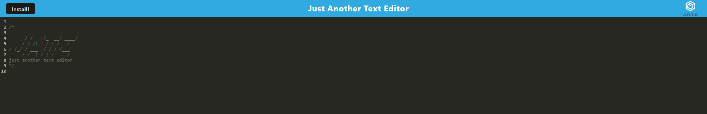
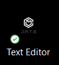

# PWA-Text-Editor 
  
## Description
  
Need to write something down but don't have a pen? Use our text editor! Download the app to put the 'fun' in 'offline functionality'.
  
## Table of Contents
  
-[Installation](#installation)
  
-[Usage](#usage)
  
-[License](#license)
  
-[Credits](#credits)
  
-[Contributions](#how-to-contribute)
  
## Installation
  
No installation is necessary! Simply follow [this link](https://pwa-text-editor-g1po.onrender.com) to be taken to the deployed application.
  
## Usage
  
To use, simply type in the provided text editor area anything you wish. Our application uses client-side indexedDB storage so if you lose internet or accidentally close your browser, anything you have typed will still be there when you come back!

Even better, you may download the application to use directly from your desktop or mobile device. Simply click the install button located at the top left of your screen and you will be prompted to install the Text Editor.

Once you have installed, you will have an icon on your desktop that looks like this:

Simply open this app to have the complete functionality of our website no matter where you go!

## License

[This project uses the following license: MIT](https://opensource.org/licenses/MIT)

## How to Contribute
  
Please contact me on github or through my email listed below if you have any ideas or want to help extend my project!

## Questions

[Please follow this link to my GitHub profile!](https://github.com/kurtriecken)

For any additional questions, please [email me here.](mailto:kurt.riecken@gmail.com)

## Credits
  
[Kurt Riecken](https://github.com/kurtriecken)